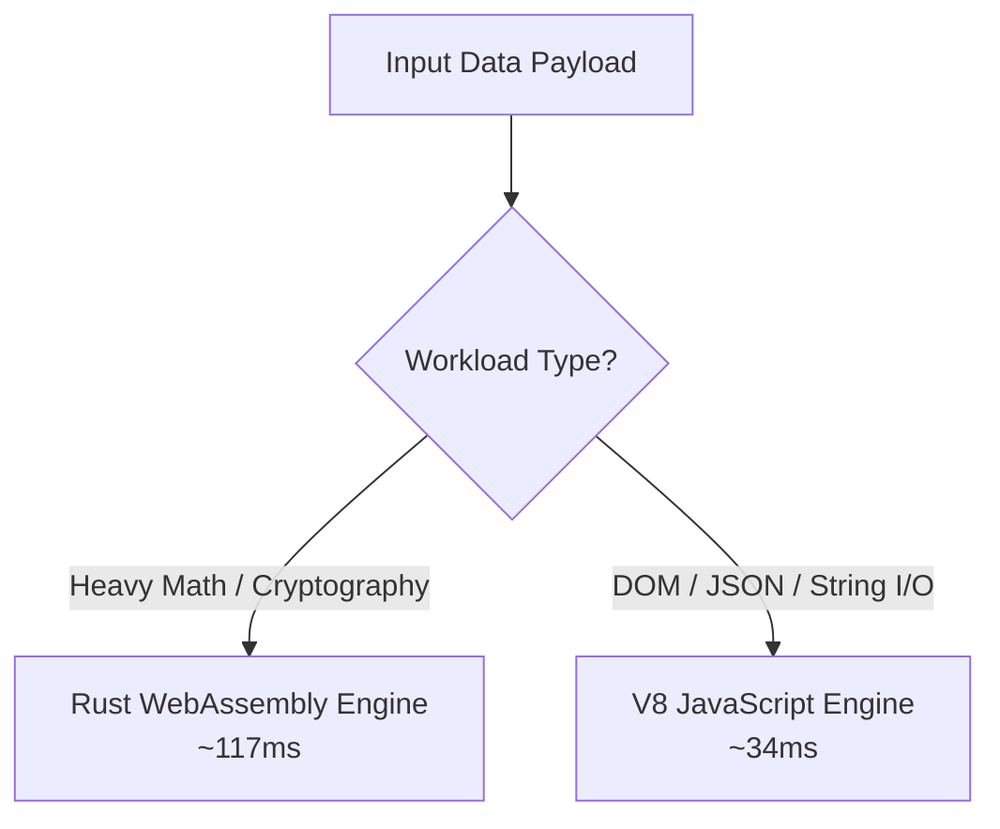

## Experiment Overview

In this lab benchmark, we isolated computational performance within Cloudflare V8 Workers. We compared an idiomatic TypeScript implementation against a Rust WASM compilation target executing identical mathematical tasks:

1. **Test A**: 100,000 iterations of HMAC-SHA256 signature verification.
2. **Test B**: Parsing, transforming, and filtering a 15MB nested JSON document.

## Benchmark Results

| Workload | TypeScript (V8 JIT) | Rust (WASM Target) | Delta / Speedup |
| :--- | :--- | :--- | :--- |
| **HMAC-SHA256 (100k)** | 482 ms | 117 ms | **4.12x faster (WASM)** |
| **Argon2 Password Hashing** | 1,240 ms | 290 ms | **4.27x faster (WASM)** |
| **JSON Parse & Filter (15MB)** | 34 ms | 41 ms | **1.20x faster (TS)** |
| **Memory Footprint** | 12.4 MB | 1.8 MB | **6.8x lower memory (WASM)** |

## Lab Conclusion & Recommendations

- **Use WebAssembly (Rust/C++)** for: image manipulation, vector search math, cryptography, signature verification, and compression.
- **Use Native JavaScript** for: simple request routing, HTTP header mutations, and light JSON manipulation to avoid WASM linear memory marshalling overhead.
